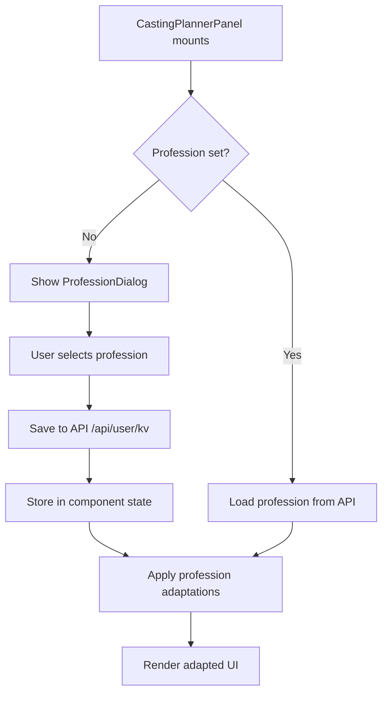

# Casting Planner Profession Selection Implementation

## Overview

Legge til en profesjonsvelger-dialog som vises når casting planner åpnes for første gang (eller hvis profesjon ikke er satt). Valget lagres i brukerprofil og tilpasser casting planner basert på valgt profesjon.

## Architecture




## Implementation Steps

### 1. Create Profession Selection Dialog Component

**File**: `src/components/CastingProfessionDialog.tsx`

- Create a new dialog component with Material-UI Dialog
- Display two options: "Fotograf" (photographer) and "Videograf" (videographer)
- Use icons from Material-UI (PhotoCameraIcon for photographer, VideocamIcon for videographer)
- Use profession colors from existing configs:
- Photographer: `#10b981` (green)
- Videographer: `#8b5cf6` (purple)
- Add descriptive text for each profession
- Make dialog non-dismissible (must select a profession)

### 2. Add Profession State Management

**File**: `src/components/CastingPlannerPanel.tsx`

- Add state: `const [profession, setProfession] = useState<'photographer' | 'videographer' | null>(null);`
- Add state for dialog: `const [professionDialogOpen, setProfessionDialogOpen] = useState(false);`
- Create function to load profession from API: `loadProfession()`
- Use `/api/user/kv/casting-profession` endpoint
- Fallback to localStorage if API fails
- Create function to save profession: `saveProfession(profession: string)`
- Save to `/api/user/kv` endpoint
- Also save to localStorage as backup

### 3. Profession Configuration

**File**: `src/components/CastingPlannerPanel.tsx` (or separate config file)Create profession configuration object:

```typescript
const PROFESSION_CONFIG = {
  photographer: {
    name: 'Fotograf',
    color: '#10b981',
    icon: PhotoCameraIcon,
    terminology: {
      project: 'Fotoprosjekt',
      shot: 'Bilde',
      shoot: 'Fotoshooting',
      // ... more terms
    },
    defaultCrewRoles: ['photographer', 'assistant', 'stylist'],
    shotListFields: ['aperture', 'shutter', 'iso', 'focal_length'],
    candidateRequirements: ['portfolio', 'photos'],
  },
  videographer: {
    name: 'Videograf',
    color: '#8b5cf6',
    icon: VideocamIcon,
    terminology: {
      project: 'Videoprosjekt',
      shot: 'Scene',
      shoot: 'Filming',
      // ... more terms
    },
    defaultCrewRoles: ['director', 'camera_operator', 'sound_engineer', 'gaffer'],
    shotListFields: ['fps', 'resolution', 'codec', 'audio_channels'],
    candidateRequirements: ['showreel', 'demo_reel'],
  }
};
```


### 4. Check Profession on Mount

**File**: `src/components/CastingPlannerPanel.tsx`

- In the existing `useEffect` (line 296), add profession check:
- Load profession using `loadProfession()`
- If profession is null/undefined, show dialog: `setProfessionDialogOpen(true)`
- Ensure dialog shows BEFORE other initialization logic

### 5. Apply Terminology Adaptations

**File**: `src/components/CastingPlannerPanel.tsx`

- Create helper function: `getTerm(key: string): string`
- Returns profession-specific terminology
- Replace hardcoded text with `getTerm()` calls throughout the component
- Key areas to adapt:
- Tab labels
- Button text
- Form labels
- Status messages
- Dialog titles

### 6. Apply Icon and Color Adaptations

**File**: `src/components/CastingPlannerPanel.tsx`

- Update `tabConfig` array (line 261) to use profession-specific colors
- Update icons based on profession (e.g., PhotoCameraIcon vs VideocamIcon)
- Apply profession color to headers, selected states, accent colors

### 7. Apply Default Values Adaptations

**File**: `src/components/CastingPlannerPanel.tsx`

- Update default values in forms based on profession
- Example: Default crew roles when creating new project
- Example: Default shot list fields
- Update `handleCreateRole`, `handleCreateCandidate`, etc. to use profession defaults

### 8. Apply Tab/Feature Visibility Adaptations

**File**: `src/components/CastingPlannerPanel.tsx`

- Conditionally show/hide tabs based on profession
- For example: Shot-list tab might have different priority/visibility
- Use profession config to determine which tabs to show

### 9. Apply Workflow-Specific Adaptations

#### 9.1 Shot List Differences

**File**: `src/components/CastingShotListPanel.tsx`

- Add profession prop to component
- Conditionally render fields based on profession:
- Photographer: aperture, shutter, ISO, focal length
- Videographer: fps, resolution, codec, audio channels
- Update field labels using terminology

#### 9.2 Crew Roles Differences

**File**: `src/components/CrewManagementPanel.tsx`

- Add profession prop
- Filter/prioritize crew roles based on profession:
- Photographer: photographer, assistant, stylist, makeup
- Videographer: director, camera_operator, sound_engineer, gaffer, grip
- Update role suggestions/autocomplete

#### 9.3 Schedule Timing Differences

**File**: `src/components/ProductionDayView.tsx` or schedule-related components

- Add profession-specific timing templates
- Photographer: Focus on lighting conditions, time-of-day
- Videographer: Focus on scene sequences, continuity

#### 9.4 Candidate Requirements Differences

**File**: `src/components/CandidateManagementPanel.tsx`

- Add profession prop
- Update candidate form fields:
- Photographer: Portfolio upload, photo samples
- Videographer: Showreel upload, demo reel, video samples
- Update candidate card display

### 10. API Integration

**File**: `src/components/CastingPlannerPanel.tsx`Create helper functions using existing API patterns:

```typescript
const loadProfession = async () => {
  try {
    const response = await fetch(`/api/user/kv/casting-profession?user_id=${userId}`);
    if (response.ok) {
      const data = await response.json();
      return data.value;
    }
  } catch (error) {
    // Fallback to localStorage
    return localStorage.getItem('casting-profession');
  }
};

const saveProfession = async (profession: string) => {
  try {
    await fetch('/api/user/kv', {
      method: 'POST',
      headers: { 'Content-Type': 'application/json' },
      body: JSON.stringify({
        key: 'casting-profession',
        value: profession,
        user_id: userId
      })
    });
    localStorage.setItem('casting-profession', profession);
  } catch (error) {
    // Fallback to localStorage only
    localStorage.setItem('casting-profession', profession);
  }
};
```


### 11. Update Component Props

**Files**: All child components that need profession

- Add `profession?: 'photographer' | 'videographer'` prop to:
- `DashboardPanel`
- `RoleManagementPanel`
- `CandidateManagementPanel`
- `CrewManagementPanel`
- `CastingShotListPanel`
- `ProductionDayView`
- `AuditionSchedulePanel`
- Pass profession prop from `CastingPlannerPanel` to all child components

## Files to Modify

1. **New File**: `src/components/CastingProfessionDialog.tsx`
2. **Modify**: `src/components/CastingPlannerPanel.tsx`

- Add profession state and dialog
- Add profession config
- Add load/save functions
- Apply adaptations throughout

3. **Modify**: `src/components/CastingShotListPanel.tsx`

- Add profession prop
- Conditionally render fields

4. **Modify**: `src/components/CrewManagementPanel.tsx`

- Add profession prop
- Filter crew roles

5. **Modify**: `src/components/CandidateManagementPanel.tsx`

- Add profession prop
- Update candidate requirements

6. **Modify**: `src/components/ProductionDayView.tsx` (if exists)

- Add profession prop
- Apply timing adaptations

7. **Modify**: `src/components/DashboardPanel.tsx`

- Add profession prop
- Apply terminology

## Testing Considerations

- Test dialog appears on first visit
- Test profession persists across sessions
- Test all terminology changes
- Test workflow-specific adaptations
- Test API fallback to localStorage
- Test profession change (if allowed later via settings)

## Future Enhancements

- Add "Endre profesjon" option in settings
- Support for multiple professions (user can switch)
- Profession-specific templates/examples