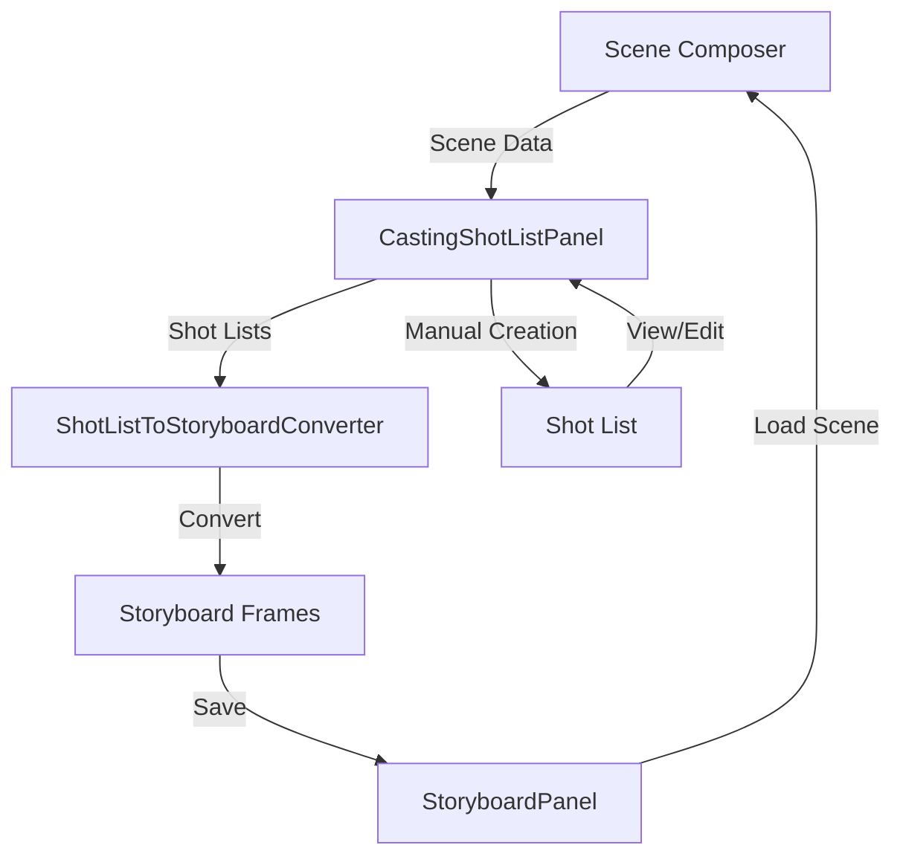

# Storyboard og Sceneliste Forbedringer

## 1. Hvordan Storyboard fungerer

### Nåværende system

- **StoryboardPanel** ([src/panels/StoryboardPanel.tsx](src/panels/StoryboardPanel.tsx)): Manuell capture fra 3D viewport
- **StoryboardCaptureService**: Tar screenshots av 3D-scenen
- **FrameCard**: Viser individuelle frames med metadata (shot type, camera angle, duration)
- **StoryboardTimeline**: Timeline-visning av frames
- **AnimaticPlayer**: Spiller av storyboard som animatic

### Foreslåtte forbedringer

1. **Integrasjon mellom shot lists og storyboards** - konverter shot lists til storyboard frames
2. **Bedre visualisering** - timeline, previews, og bedre organisering
3. **Gjenbruk av komponenter** - bruk samme styling og patterns som storyboard

## 2. Implementeringsplan

### A. Shot List til Storyboard Converter

Opprett service som konverterer mellom data-strukturer:**Fil**: `src/core/services/shotListToStoryboardConverter.ts`

- Konverterer `CastingShot` til `StoryboardFrame`
- Mapper shot metadata (shotType, cameraAngle, etc.)
- Genererer preview-bilder fra scene snapshots hvis tilgjengelig
- Beholder all metadata fra shot list

### B. Forbedre Sceneliste-fanen

**Fil**: [src/components/CastingShotListPanel.tsx](src/components/CastingShotListPanel.tsx)**Forbedringer**:

1. **Visualisering**:

- Legg til timeline-visning (gjenbruk `StoryboardTimeline`-komponent)
- Mini-preview av shots i grid-kortene
- Bedre visuell hierarki med farger og ikoner
- Shot-progresjon visning (Wide → Medium → Close-up)

2. **Storyboard-integrasjon**:

- "Opprett storyboard fra shot list"-knapp
- Automatisk konverter shot list til storyboard frames
- Sync mellom shot lists og storyboards
- Vis relaterte storyboards for hver shot list

3. **Forbedret visning**:

- Expandable cards med shot-detaljer (som i eksisterende design)
- Bedre organisering av shots innen hver shot list
- Visualisering av shot-typer med farger (gjenbruk `getShotTypeColor`)

4. **Gjenbruk eksisterende komponenter**:

- `FrameCard`-stil for shot-visning
- `StoryboardTimeline` for timeline-visning
- Grid/Table view patterns fra andre paneler

### C. Nye komponenter

1. **ShotListToStoryboardDialog**

- Dialog for å konvertere shot list til storyboard
- Valg av hvilke shots som skal inkluderes
- Preview av resultatet før konvertering

2. **EnhancedShotListCard**

- Forbedret versjon av eksisterende shot list cards
- Inkluderer mini-timeline, shot-previews
- Gjenbruker styling fra `FrameCard` og andre card-komponenter
- Viser relaterte storyboards hvis de eksisterer

3. **ShotListTimeline**

- Timeline-visning spesifikk for shot lists
- Gjenbruker logikk fra `StoryboardTimeline`
- Viser shot-progresjon og varighet

## 3. Komponenter å gjenbruke

### Fra StoryboardPanel:

- `FrameCard` - styling og layout for shot-visning
- `StoryboardTimeline` - timeline-visning logikk
- `storyboardCaptureService` - capture-funksjonalitet
- `getShotTypeColor`, `getShotTypeLabel` - hjelpefunksjoner

### Fra andre paneler:

- Grid/Table view patterns fra:
- `CandidateManagementPanel` - responsive grid med cards
- `PropManagementPanel` - expandable cards med metadata
- `LocationManagementPanel` - gradient headers og chips

### Styling patterns:

- `TOUCH_TARGET_SIZE` - for touch-friendly knapper
- `focusVisibleStyles` - for accessibility
- Responsive design med `useMediaQuery` og `useTheme`

## 4. Dataflyt

## 5. Implementeringssteg

1. **ShotListToStoryboardConverter** - konvertering mellom data-strukturer
2. **Forbedre CastingShotListPanel** - visualisering og integrasjon
3. **ShotListToStoryboardDialog** - UI for konvertering
4. **EnhancedShotListCard** - forbedret card-visning
5. **ShotListTimeline** - timeline-visning for shot lists
6. **Testing og integrasjon** - test med eksisterende data

## 6. Tekniske detaljer

### Data-strukturer

- `CastingShot` (fra casting models) → `StoryboardFrame` (fra storyboardStore)
- Felles felter: `shotType`, `cameraAngle`, `cameraMovement`, `description`
- Mapping: `CastingShot.roleId` → `StoryboardFrame.title`
- `CastingShot.sceneId` → `StoryboardFrame.sceneSnapshot` (hvis tilgjengelig)

### API-integrasjon

- Bruk eksisterende `castingService` for shot lists
- Bruk `storyboardSyncService` for storyboard-sync
- Bruk `storyboardStore` for å lagre nye storyboards

### Styling

- Gjenbruk eksisterende tema-farger (#e91e63 for casting, storyboard-farger for frames)
- Responsive design med `useMediaQuery` og `useTheme`
- WCAG-kompatibel med `TOUCH_TARGET_SIZE` og `focusVisibleStyles`