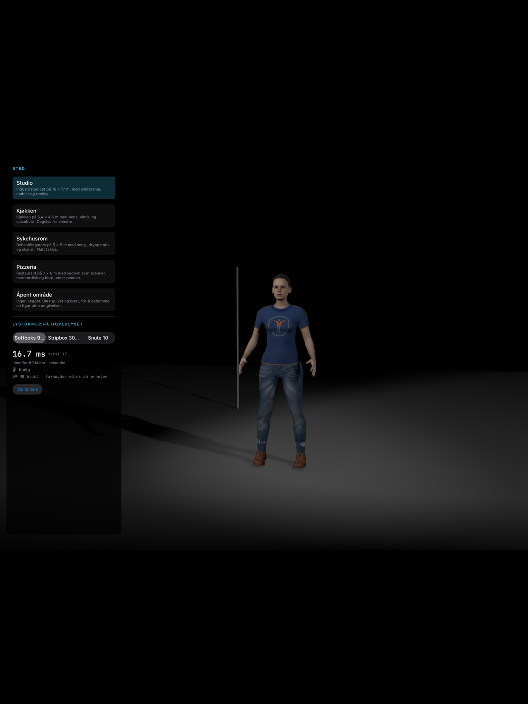
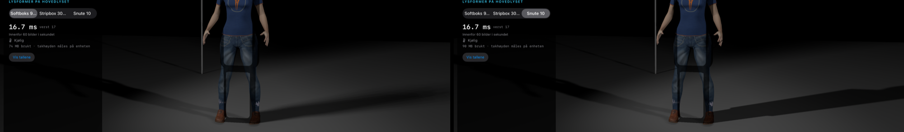
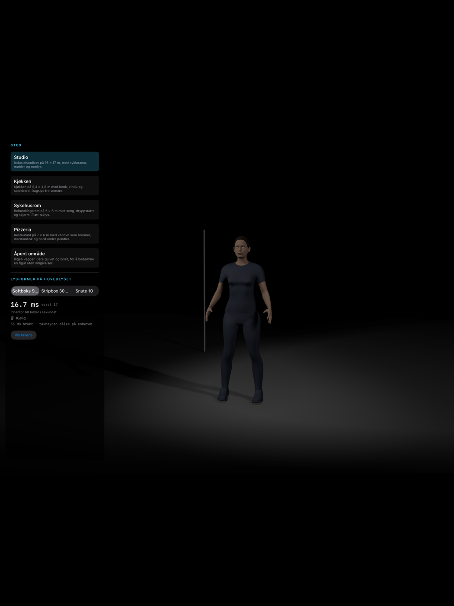
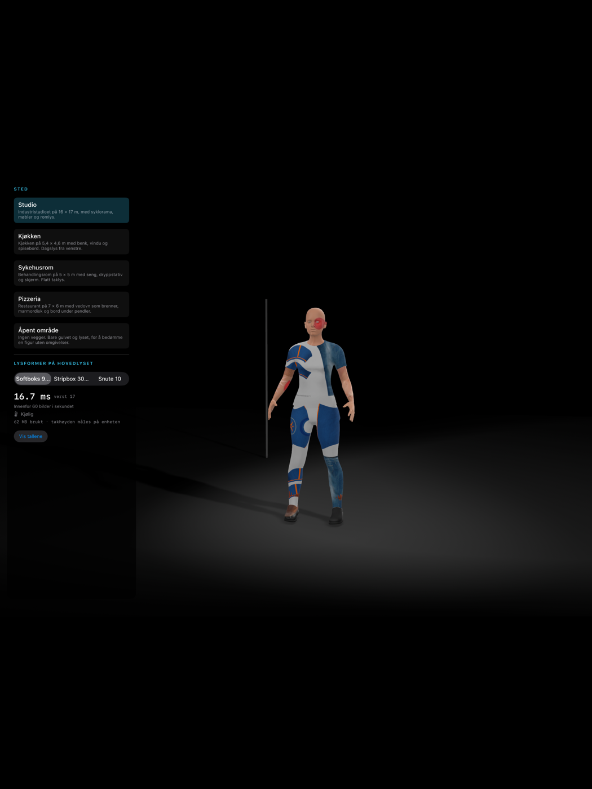
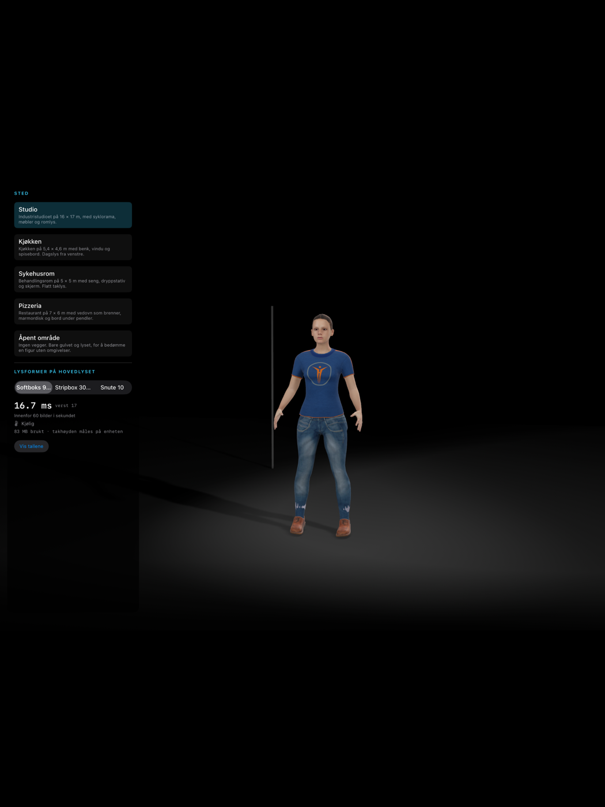

# The first measurements

Taken by the iPad app in `apple/Virtualstudio`, which exists for this: to answer
the questions in [`../ipad-plan.md`](../ipad-plan.md) with numbers instead of
expectations.

**On the iPad Pro 13-inch (M5) simulator, iOS 26.5. Not a device.** The plan says
so itself, and it says it about the browser tests too: a simulator answers nothing
about frame time, thermals or memory. What it can answer is whether an API does
what the product needs, and both findings below are about that.

Reproduce:

```sh
cd apple && xcodegen generate
xcodebuild -project Virtualstudio.xcodeproj -scheme Virtualstudio \
  -destination 'platform=iOS Simulator,name=iPad Pro 13-inch (M5)' build
xcrun simctl launch <udid> no.holycrust.virtualstudio --modifier "Snute 10 cm"
xcrun simctl launch <udid> no.holycrust.virtualstudio --stops -1
```

## 1. A modifier's size changes nothing

`shadow-Softboks.png` and `shadow-Snute.png` are the same frame with the key on a
90 × 120 cm softbox and on a 10 cm snoot. By the arithmetic the product is built
on, those are a 1.04 m source and a 0.10 m source, and
`contactHardeningRatio` puts their penumbra widths a factor of ten apart.

Rendered, across 3 296 896 pixels of the scene:

```
max difference   0
mean difference  0.0
pixels differing by more than 2   0
```

Not close — identical. RealityKit has no penumbra to set, so the shadow of a
metre-wide softbox and the shadow of a snoot are the same shadow. This is the
thing the product sells, and it is the finding that decides the renderer: either
a custom Metal shadow pass through `renderingEffects.customPostProcessing`, or
Metal for the scene.

The rod standing in front of the wall is in the frame for this reason. A face has
no straight edge to read a penumbra against.

## 2. The picture is now linear in the light

*Answered, and then fixed.*

`stops0.png` and `stops-1.png` are the same rig one stop apart. Read as raw pixel
values they looked like this, and the conclusion drawn from them — that some of the
difference was display gamma and the rest was tone mapping — was right:

| Rig | Mean pixel |
|---|---|
| as written | 41.69 |
| one stop down | 24.21 |
| two stops down | 12.53 |

But a pixel value is not a quantity of light. Decoded through the sRGB transfer,
which is what a display encodes with, the same frames say exactly how much the
curve was costing:

| Rig | Linear mean | Ratio | Stops measured |
|---|---|---|---|
| as written | 0.02435 | 1.000 | +0.000 |
| one stop down | 0.00984 | 0.404 | **−1.307** |
| two stops down | 0.00399 | 0.164 | **−2.608** |

A third of a stop lost per stop. A photographer judging a two-to-one ratio would
have been shown nearer five to two.

`RealityRenderer.CameraSettings.isToneMappingEnabled` turns it off, and
`RealityView` does not expose it — searching the whole `_RealityKit_SwiftUI`
interface for "tonemap" returns nothing. So the studio is rendered by hand:
`StudioRenderer` owns a `RealityRenderer`, renders into a half-float texture the app
owns and composites that to the drawable.

The same three frames, through that:

| Rig | Linear mean | Ratio | Stops measured |
|---|---|---|---|
| as written | 0.04756 | 1.000 | +0.000 |
| one stop down | 0.02378 | 0.500 | **−1.000** |
| two stops down | 0.01189 | 0.250 | **−2.000** |

To three decimal places. One stop of light is one stop on the screen.



Rendering into a texture the app owns rather than straight to the drawable is also
what the shadow pass needs: the second render and its composite hang there, which
is how the Campfire Games project gets a depth buffer RealityKit will not hand
over.

## 3. The shadow, and a modifier that changes it

*Finding 1 said the penumbra had to be drawn by hand. It now is.*



Softbox left, snoot right, same frame otherwise. Over the floor, clear of the
panel:

```
differing by more than 2 levels   56,414 of 756,600 pixels
greatest difference               53 levels
```

Against RealityKit's own shadow, the same comparison was a maximum difference of
**zero** across three million pixels.

How it is done, and why it took so long to get here:

- **The position is rendered, not reconstructed.** A `CustomMaterial` surface
  shader is handed `world_position()` for every fragment it shades, and a second
  `RealityRenderer` over a cloned scene writes that into a half-float texture the
  app owns. Nothing reads RealityKit's depth buffer, because nothing can — see
  finding 4.
- **The clone shares meshes and never entities**, and follows the original each
  frame: transforms, what is switched on, and `jointTransforms`, so the shadow is
  of the figure as posed rather than as bound.
- **The cutout is cut in that pass too.** `CustomMaterial` does not apply
  `opacityThreshold` on its own, so the shader samples the base colour's alpha and
  discards below the cutoff. Without it, hair writes the position of a rectangle.
- **The composite traces from those positions** to a light that is a disc as wide
  as the modifier really is. A surface that can see all of the disc is lit, one
  that can see none of it is in shadow, one that sees part of it is in the
  penumbra — which is what a penumbra physically is, and why its width follows the
  source and the distance with nothing tuned by hand.

What is still approximate, and named rather than hidden: the occluders in the trace
are the analytic boxes and sphere the stand-in figure was made of, not the figure's
own geometry. They are the right size and in the right place, so the shadow is the
right shape, but a shadow map from the light is what makes it exact. And the rod
that was put in the frame as a penumbra gauge is standing against an unlit wall, so
it casts nothing to measure a width against; a width in millimetres needs the gauge
lit, which is the next small thing.

## 4. The depth texture cannot be read — in the simulator

This is the one to settle on the device, and it is worth stating exactly, because
the failure gives no signal at all.

The pass composites correctly. Painting the frame solid turns the screen solid;
multiplying the colour by 0.18 darkens the picture. Both confirmed with the
shader as a compute kernel and again as a fragment shader.

**Any access to `context.sourceDepthTexture` discards everything after it.** Not
an error, not a warning, not a log line: the instructions before the first access
run and are visible, the instructions after are gone, and the frame arrives
exactly as RealityKit rendered it. A shader that has quietly lost half its body
looks identical to a shader whose logic is wrong, which is where most of the time
on this went.

Four ways were tried, all with the same result:

| Attempt | Result |
|---|---|
| `depth2d<float, access::read>` in a compute kernel | everything after the read discarded |
| `texture2d<float, access::read>` in a compute kernel | same |
| `depth2d<float>` sampled in a fragment shader | same |
| blit into a private `shaderRead`-only copy, sampled | same |

The texture itself reports nothing unusual:

```
depth 2752x2064  format=260 (.depth32Float)  usage=5 (.shaderRead|.renderTarget)
type=2 (.type2D)  samples=1        colour usage=5
```

Same size as the colour texture, declared readable, not multisampled, not an
array. By its own description it should read.

**It is not a simulator limitation.** The Campfire Games project hit the same wall
and wrote the answer into a shader comment — "without reading RealityRenderer's
inaccessible internal depth texture" — and works around it by rendering the scene a
second time through a `CustomMaterial` surface shader that writes camera-space
depth into emissive colour. A surface shader is handed
`params.geometry().world_position()` for every fragment, which is more than this
pass was ever going to reconstruct from a depth buffer. See
[`../campfire-precedent.md`](../campfire-precedent.md).

What stood here said this was most likely a simulator limitation rather than an
API one, and it
is exactly the kind of thing the plan says a simulator cannot answer. The next
step is not more shader work: it is to run the same build on the physical M5 iPad
and see whether the depth texture reads there. Everything needed for that is in
place — the pass, the debug modes, and the two launch arguments.

If it reads on the device, the shadow pass finishes in an afternoon: the
occlusion tracing already works against the reconstructed positions. If it does
not read there either, the conclusion is larger and clearer — a custom shadow in
RealityKit's post-process has nothing to reconstruct from, and the scene renderer
has to be Metal.

## 5. The figure, on the screen



Not a measurement, but the thing the measurements are for. Everything in that
picture came through the pipeline the plan now describes:

`build_studio_characters.py` → GLB → `StudioAssets` → skinned on the processor →
`visibleParts` → `MeshDescriptor` → RealityKit. The rig lighting her is the
`studio-portrett` look out of `content.json`, placed by `resolvePlacement` and
swung clear of the lens by `clearOfCamera`. She wears what
`wardrobe.json` says she opens in, and the body draws only the triangles the suit
does not cover — 103 parts rather than a rebuilt buffer.

55 MB and 16.7 ms in the simulator, which measures nothing about the device.

### The authored surfaces



The five surfaces are the point: skin, eyes, hair and cloth do not look alike, and
flattening them to one grey material is a failure the web renderer already had
once. The textures are not in the GLB — the builder writes them once beside the
models and refers to them by relative path, because a garment is mostly texture
and the same cloth is worn by every body cut for it.

`scripts/apple/stage-assets.py` follows those references and stages only what the
app asks for: two figures, the clothes they open in, and **13 of the texture
directory's files**. The directory is 76 MB; the app carries 40.

### Fixed, by handing the job to RealityKit



Hair draws, the eyes are eyes, and the clothes cover the body. Nothing about the
material configuration was solved — it was **removed**. The builder writes a USDZ
beside the glTF, and `UsdPreviewSurface` says in one line what two attempts in
Swift could not: `opacity` connected to the texture's alpha channel,
`opacityThreshold` beside it. RealityKit's own loader obeys it, and does the
skinning too.

The wardrobe is regions rather than a rebuilt buffer. Every triangle of the body is
labelled at build time with the set of garments that hide it, triangles sharing a
label become one prim — **eleven of them for a body with six garments** — and
dressing the figure means leaving those parts out of the mesh.

Leaving them out, not switching them off: RealityKit's USD loader merges every mesh
prim of a model into one `ModelEntity` whose mesh carries a part per prim, so the
prim's own entity is an empty wrapper and disabling it changes nothing at all. The
parts keep the prim names, and `MeshResource.Contents` is rebuilt without the
covered ones — instances as well as models, since an instance pointing at a model
that is gone is a mesh that will not build. Skinning survives it.

### What it looked like built by hand

Skin and cloth were right. **Hair and eyes were not** — and the reason is now known
rather than guessed. A cutout has to be told where its opacity comes from;
`opacityThreshold` alone does not establish it. Campfire connects `opacity` to the
texture's alpha channel in USD and sets the threshold separately, and does the same
comparison by hand in its own shader because "CustomMaterial does not apply
opacityThreshold automatically". See [`../campfire-precedent.md`](../campfire-precedent.md).

As it stands: the hair does not draw at
all, and the eye reads as a red patch. The reader resolves both correctly — a test
asserts each surface names its own file and that hair alone is marked as a cutout
— so the fault is in how the material is configured against RealityKit, not in
what it was told. Two attempts at the cutout (a threshold, and blending pointed at
the base colour's own alpha) both leave the hair invisible. It is left visible in
the picture rather than papered over with an opaque helmet.

Also still missing: normals that follow the pose rather than the rest stance,
which needs the renderer's own skinning rather than the processor's.

## 6. On the device

*iPad Pro 13-inch (M5), iPadOS 27. Seventeen minutes of rendering.*

| State | Duration | Frame time: min / median / p95 / max |
|---|---|---|
| `nominal` | 489 s | 9.69 / **13.83** / 14.54 / 35.27 ms |
| `fair` | 103 s | 13.70 / **14.02** / 14.98 / 19.19 ms |

**It gets warm and it costs nothing.** The thermal state reached `fair` after
sixteen minutes of drawing and never went past it. The median frame moved from
13.83 ms to 14.02 — two hundredths. That is the answer to the question that
matters on location: the preview does not quietly stop matching what was set.

**Sixty frames a second with room, not a hundred and twenty.** Capped at 60 it
holds 16.67 ms exactly, worst frame 16.8. Uncapped it settles at 13.8 ms where the
budget for 120 Hz is 8.33 — about seventy frames a second.

**Memory: 892–905 MB used, headroom never below 4214 MB.** That is
`os_proc_available_memory`, which the simulator reports as zero. Nowhere near
jetsam, but 900 MB for two figures and a rig is heavy — the textures are large PNGs
and they are decompressed.

### Where the time goes

The GPU's own clock agrees with the wall clock almost exactly — median 13.65 ms
against 13.60 — so the cost is work rather than scheduling. Run the same frame with
the shadow passes switched off:

| | GPU frame | GPU worst |
|---|---|---|
| with the shadow pass | 13.96 ms | 22.03 ms |
| without it | **0.99 ms** | 2.44 ms |

**The scene is free and the shadow is the whole frame.** Two figures, a room, three
shadow-casting lights and the taking camera cost one millisecond on an M5. The soft
shadow costs thirteen — a second full render of the scene for the position pass,
and a composite that traces twenty-four rays against four occluders for every one
of 5.7 million pixels.

That is not a reason to give the shadow up; it is the product. It is a reason to
spend the next hour on that composite rather than anywhere else, and the obvious
lever is the one Campfire already documents: the pass does not have to run at the
colour resolution.

### The shadow at its own resolution

The term does not need the picture's resolution. A penumbra is a gradient by
definition, and a gradient upsamples honestly where a silhouette would not — so it
is computed into a one-channel texture of its own and sampled linearly on the way
back. The position it reads stays full resolution and is sampled nearest, so no
pixel is ever handed a place halfway between a near edge and a far floor.

On the device:

| Shadow term at | GPU frame | GPU worst |
|---|---|---|
| full resolution | 13.94 ms | 14.42 ms |
| **one half** | **5.53 ms** | 7.08 ms |
| one quarter | 3.83 ms | 4.26 ms |
| no shadow at all | 0.99 ms | 2.44 ms |

And what it costs, measured in the simulator where a frame can be captured — same
shaders, and an image comparison rather than a timing:

| Against the full-resolution shadow | Mean difference | p99 | Max |
|---|---|---|---|
| one half | **0.08 levels** | 1 | 36 |
| one quarter | 0.13 levels | 2 | 36 |

Eight hundredths of a level, and the maximum is a handful of pixels on a hard
silhouette. Half resolution is the default because it saves 8.4 ms and costs
nothing anyone can see.

The feature survives it: with the term at half resolution, a 1.04 m softbox and a
0.10 m snoot still differ over 56 295 pixels, against 56 414 at full resolution.

At 5.53 ms the whole frame fits inside a 120 Hz budget for the first time.

### Two things the measurement found on its own

**The iPad went to sleep twice**, 229 seconds each time, in the middle of the run.
The app kept its process and came back at 10.7 ms, but a studio on a stand should
not fall asleep between two lighting decisions. `isIdleTimerDisabled` is one line
and it is in.

**The reporting was in the frame it was reporting on.** A steady 23.5 ms worst
frame looked like a cost on a clock, so the log line was moved off the render
thread — no change — and then the `task_info` memory walk was moved off as well —
no change either. Both hypotheses were wrong and both are recorded as wrong: the
23 ms is real GPU work, and the GPU clock says so.

## What is still unmeasured

Everything that needs the hardware: sustained frame time, `thermalState` over a
real session, and `os_proc_available_memory`, which the simulator reports as
zero. The app shows all three on screen for exactly that reason — the failure
that matters on location is not a crash but the preview quietly ceasing to match
what was set.
